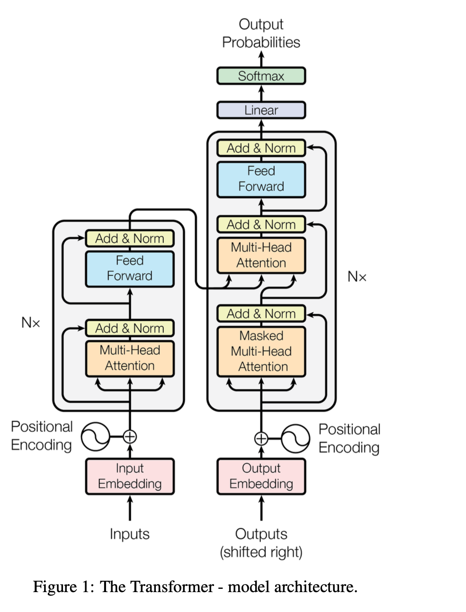

# Sanskrit-to-English Neural Machine Translation

A character-level Transformer model for translating English text to Sanskrit using PyTorch.

## Overview

This project implements a complete neural machine translation system that converts English text to Sanskrit (Devanagari script) using a Transformer architecture with multi-head attention mechanisms.


## Features

- **Transformer Architecture**: Full encoder-decoder with multi-head attention
- **Character-Level Translation**: Fine-grained tokenization for better accuracy
- **Complete Vocabulary**: Comprehensive Sanskrit character set

## Quick Start

### 1. **Install Dependencies**

```bash
pip install torch numpy matplotlib jupyter
```

### 2. **Train the Model** (Optional)

```bash
cd transformer/
jupyter notebook final_transformer.ipynb
# Run all cells to train from scratch
```

## Model Architecture

- **Type**: Encoder-Decoder Transformer
- **Dimensions**: 512 (d_model), 2048 (FFN)
- **Attention Heads**: 8
- **Layers**: 1 (configurable)
- **Vocabulary**: 89 Sanskrit + 183 English characters
- **Max Length**: 200 characters
- **Training**: Adam optimizer, Cross-entropy loss

### Sample Translations:

- _"I am here"_ → _अहम् अत्र अस्मि_
- _"Do work don't expect result"_ → _कर्म कुर्वन्तु फलं मा प्रत्याशयन्तु_

## Technical Details

- **Framework**: PyTorch 2.0+
- **Training Data**: English-Sanskrit parallel corpus
- **Tokenization**: Character-level with special tokens
- **Attention**: Multi-head self-attention + cross-attention
- **Masking**: Look-ahead and padding masks

## Training Process

1. **Data Preparation**: Filter valid sentence pairs
2. **Vocabulary Building**: Character-level tokenization
3. **Model Initialization**: Xavier uniform weights
4. **Training Loop**: 50 epoch with checkpoint saving
5. **Evaluation**: Real-time translation testing

## Performance

- **Training**: ~50 epochs on parallel corpus
- **Inference**: Real-time character generation
- **Accuracy**: Not accurate/Accurate over large corpus
