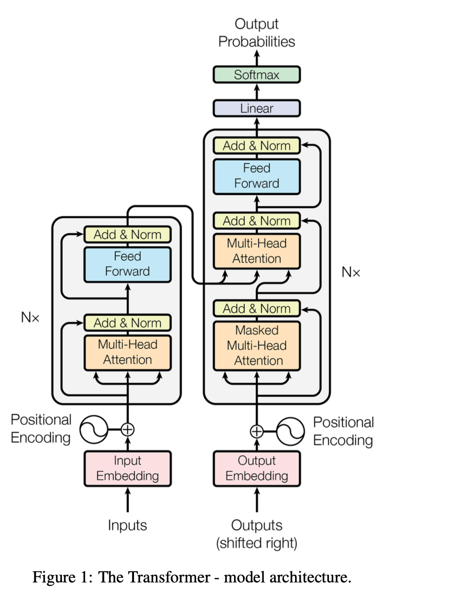
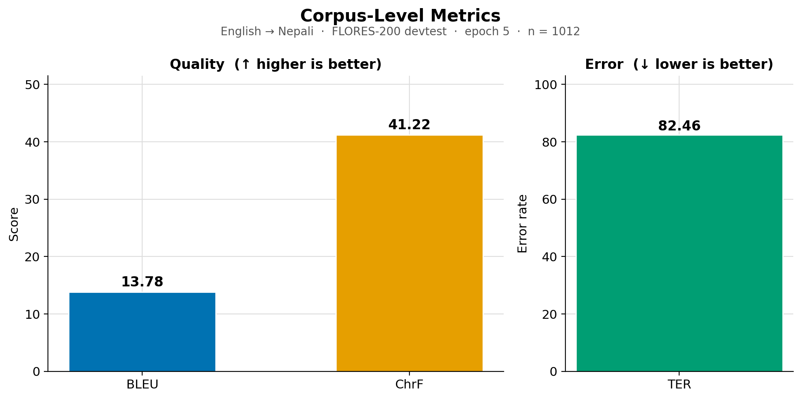
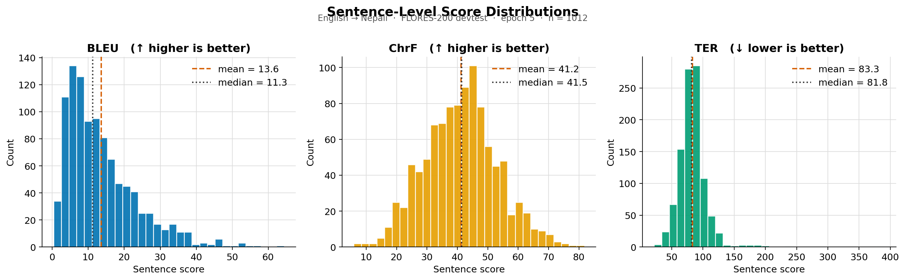
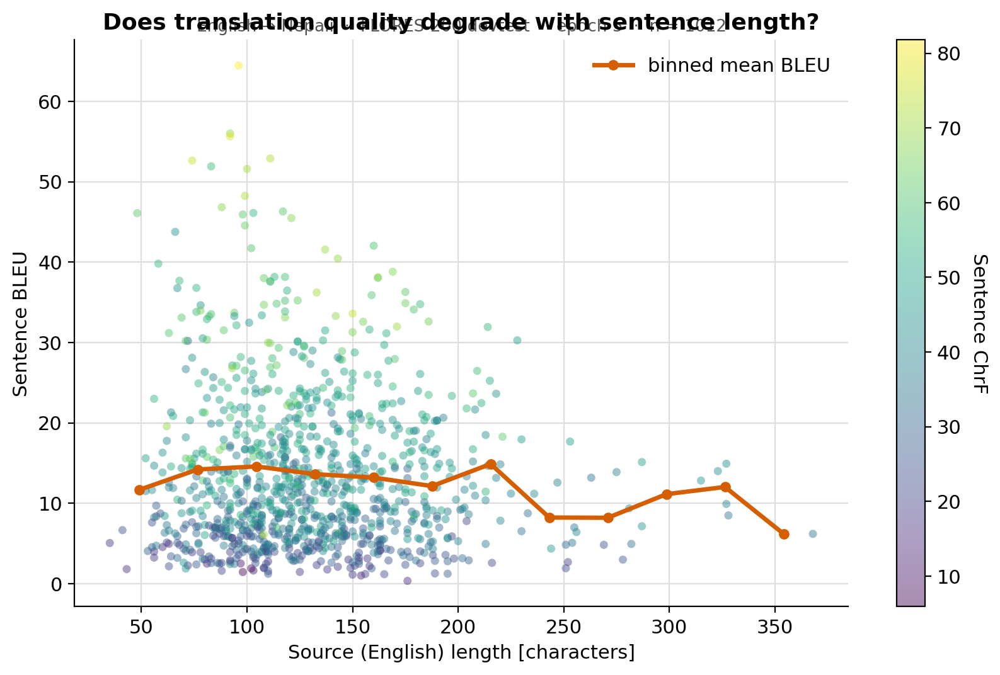
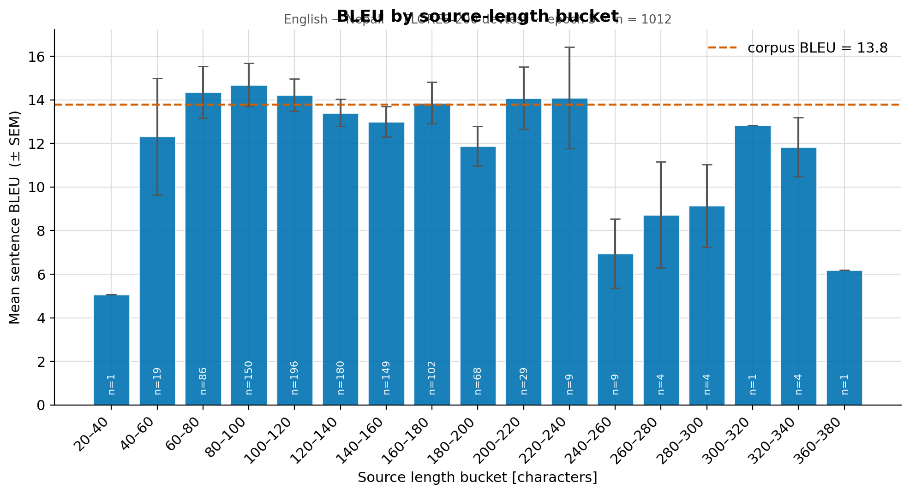
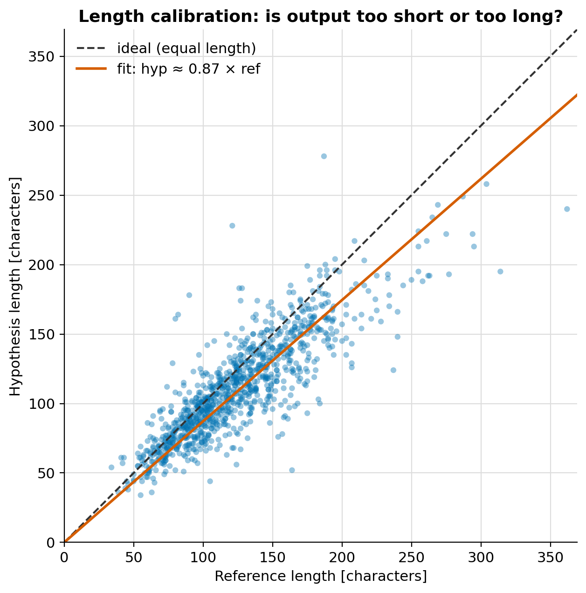
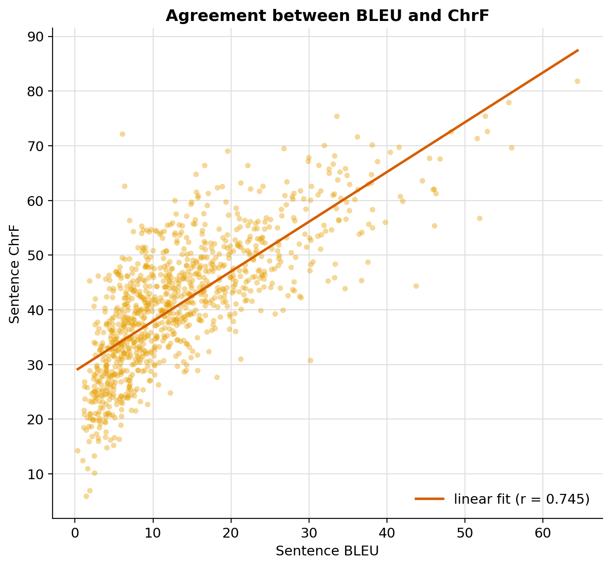

# English → Nepali Neural Machine Translation

A from-scratch Transformer (Vaswani et al. 2017) in PyTorch, trained on the NLLB
English–Nepali mined corpus and evaluated on the standard FLORES-200 benchmark. A
35M-parameter model trained on a laptop (Apple M2 Air) that produces fluent,
source-conditioned Nepali on everyday prose.

> Curious how the project got here (it began as Sanskrit→English)? The full history,
> the pivot, and the lessons are in **[learning.md](learning.md)**.



## Results

Final corpus scores on **FLORES-200 devtest** (1,012 unseen sentences, greedy decoding,
best-dev checkpoint at epoch 5). BLEU uses the `flores200` (Devanagari-aware) tokenizer.

| Metric      | Score      |
| ----------- | ---------- |
| Corpus BLEU | **13.78**  |
| Corpus ChrF | **41.22**  |
| Corpus TER  | **82.46**  |



> For a from-scratch model on a low-resource pair, **ChrF is the fairer judge** —
> Nepali's rich inflection makes BLEU's exact-word matching read low.

Double-digit BLEU and 41 ChrF from a 35M-parameter model trained from scratch on a
laptop is a solid, honest result. Large pretrained systems (NLLB, Google) score
higher because they pretrain on billions of sentences across 200 languages — but
this run proves the from-scratch pipeline genuinely works once the data has headroom.

### Example translation

The model handles everyday prose well; its best translations are near-human:

```
EN  : In remote locations, without cell phone coverage, a satellite phone may be your only option.
REF : दुर्गम स्थानहरूमा, सेल फोनको कभरेज बिना, उपग्रह फोन तपाईंको एक मात्र विकल्प हुन सक्छ।
HYP : रिमोट स्थानहरूमा, सेल फोन कभरेज बिना, एक उपग्रह फोन तपाईंको मात्र विकल्प हुन सक्छ।
      (BLEU 55.7 · ChrF 77.9)
```

**Common failure modes**: dropping rare compound terms ("machine learning" → "मेशिन"),
occasional clause repetition on long inputs, and borrowing English loanwords ("रिमोट")
where a native term exists. All expected for the data scale and greedy decoding; beam
search and more epochs would close part of the gap.

## Statistics

<table>
  <tr>
    <td></td>
    <td></td>
  </tr>
  <tr>
    <td align="center"><sub>Sentence-level BLEU / ChrF / TER distributions</sub></td>
    <td align="center"><sub>Does quality degrade with sentence length?</sub></td>
  </tr>
  <tr>
    <td></td>
    <td></td>
  </tr>
  <tr>
    <td align="center"><sub>BLEU by source-length bucket (± SEM)</sub></td>
    <td align="center"><sub>Length calibration: output too short or too long?</sub></td>
  </tr>
</table>



All graphs are regenerated by `transformer_core/evaluation.py` into
`transformer_core/eval_results/`.

## Architecture

- **Type**: Encoder–Decoder Transformer (Vaswani et al. 2017), implemented from scratch
- **Size**: d_model 384, FFN hidden 1536, 8 heads, 4 encoder + 4 decoder layers
  (**35.0M parameters**)
- **Tokenization**: SentencePiece BPE, 16,000 pieces per language, byte fallback (no UNK)
- **Sequence length**: BPE pairs capped at 96 tokens (positional capacity 128);
  median sentence is ~28 tokens
- **Components**: multi-head self/cross attention, sinusoidal positional encodings,
  layer norm, position-wise FFN — see `transformer_core/transformer.py` and the
  step-by-step notebooks in `transformer_core/components/`
- **Training**: Adam (betas 0.9/0.98), 4000-step warmup + inverse-sqrt decay, label
  smoothing 0.1, gradient clipping (max-norm 1.0), Xavier init, batch size 64
- **Hardware**: Apple Silicon (MPS), CUDA, or CPU — auto-detected

## Data & training

- **Data**: [NLLB](https://opus.nlpl.eu/legacy/NLLB.php) mined English–Nepali bitext
  (~19.6M raw pairs). Cleaned by script check, length ratio, and dedupe, then the
  **top 1,000,000 pairs by LASER mining score** are kept (`data_nepali/prepare_data.py`).
- **Benchmark**: [FLORES-200](https://github.com/facebookresearch/flores) — dev (997)
  for validation, devtest (1,012) for the final number. A standard, citable benchmark.
- **Pipeline**: SentencePiece BPE (16k vocab/side), length-bucketed batching, warmup +
  inverse-sqrt LR, label smoothing 0.1, best-dev checkpointing.
- **Training run**: 6 epochs on an Apple M2 Air (MPS), ~2 hours/epoch. Dev loss fell
  monotonically 9.69 → ~4.55 with no overfitting.

## Quick Start

```bash
pip install -r requirements.txt

# 1. Get the data (raw NLLB dump + FLORES-200 benchmark)
cd data_nepali/raw
curl -L -o en-ne.txt.zip https://object.pouta.csc.fi/OPUS-NLLB/v1/moses/en-ne.txt.zip
unzip en-ne.txt.zip
curl -L https://dl.fbaipublicfiles.com/nllb/flores200_dataset.tar.gz | tar xz
cd ..
python3 prepare_data.py --top_n 1000000   # → train.en/.ne, dev.*, test.*
cd ../transformer_core

# 2. Train tokenizers, then the model, then evaluate
python3 train_tokenizer.py   # once
python3 training.py          # resumes from checkpoint automatically
python3 evaluation.py        # BLEU/ChrF/TER + graphs on FLORES-200 devtest
```

### Inference

Open **`transformer_core/inference.ipynb`** for a notebook that loads the checkpoint
and translates English sentences interactively (select the project `venv` as the
kernel). It reuses the same tokenizers and `greedy_translate` as evaluation, so what
you see in the notebook matches the benchmark exactly.

## Better Approach — Fine-tuning

The most effective solution for low-resource translation remains fine-tuning a
pretrained multilingual model rather than training from scratch. A related project
demonstrates this:

**[Fine-tuning Llama-2-7b-chat-hf with QLoRA](https://github.com/ankitpokhrel08/llm-projects/tree/main/finetuning_Llama-2-7b-chat-hf)**

Pretrained language understanding + parameter-efficient fine-tuning gives superior
quality at a fraction of the compute.
